# LINKS

# MODEL TRAINING

# STEP 1: DATA COLLECTION

Basically, the proposed task is a Emnist dataset recognition.

Datasets:
https://www.kaggle.com/datasets/crawford/emnist - Extended MNIST ( ENG LETTERS + NUMS )

## Emnist dataset

Dataset of a handwritten character digits + english letter. The balanced version of dataset includes 47 classes 3000 images each
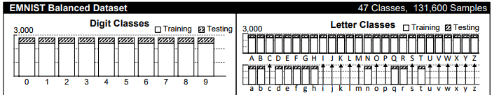

Some of the letters are presented in lowercase AND uppercase form, but I will not combine them as it would affect the classes distribution. However, on the production stage we'll capitilize letters if the model says it is in lowercase.

Data is presented in two excel files, each row represents one image flattend into ( 784, ) vector.
After collecting the data and reshaping it into ( 28, 28, 1 ) matrix we can see that the images are flipped.

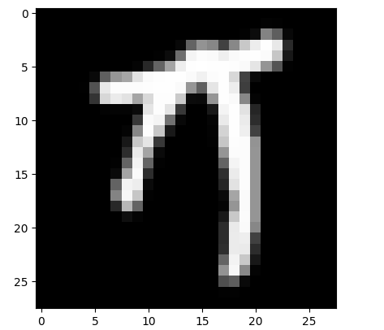

So the first thing to do in preprocessing is flipping the images.
After flipping we've get such arrays:
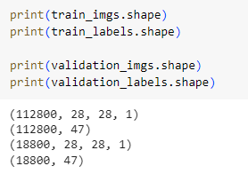

# STAGE 2: NORMALIZATION
I've decided to normalize the image by scaling everything to [0, 1]

# STAGE 3: TRYING WHAT'VE ALREADY DONE

As I've sayed, the dataset is just a EMNIST. That's being said, it already have some of the solutions on kaggle. I've decided to start my journey from trying someone's solution.

Solutions is taking from here: https://www.kaggle.com/code/achintyatripathi/emnist-letter-dataset-97-9-acc-val-acc-91-78

Train / test split is 0.3
Epochs count: 25

The model stopped on 5 epochs without imporving in validation accuracy
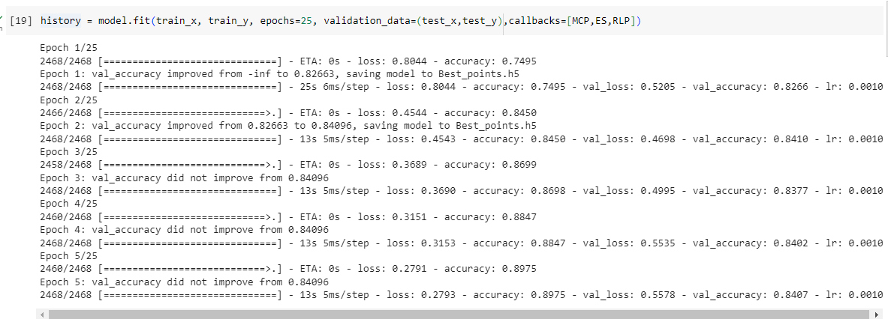

The difference between the solution in link, and mine file is that the guys from kaggle took just letters and not the combination of letters + numbers datasets.
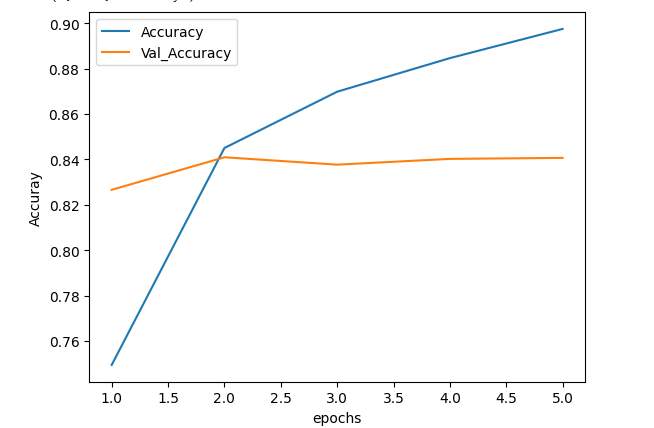

As we can see from graph, the model has been overfitted pretty quickly, so my initial thought was to add dropout layer with 0.2 coef and add the activation function to convolutional layer ( because validation accuracy isn't actually dropping, so it might be underfitting as well ).

The test acccuracy did improve from 0.84 to 0.85, but it is still a pretty low result.
My next thought was to try and make the model more complicated again. So I've came up with something like that.
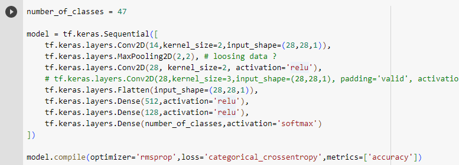

I've added a liniary convolutional layer on top, and I've added a second convolutional layer after max pooling. Also, I've lowered the numbers of kernal size from 3 to 2 ).
I've also increased patient time on early stoppers as I thought the model might be an unpredicted in decreasing loss error.
This approach showed a test score of 0.86 accuracy and an overfitting curve 
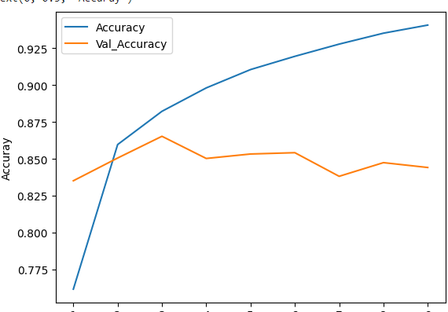
I've choosen to stay with the same convolutional approach.
The next step was to add more fully-connected layers, and also set some dropouts between them so that the model would not overfit very much. Also, optimizer was changed to adam.

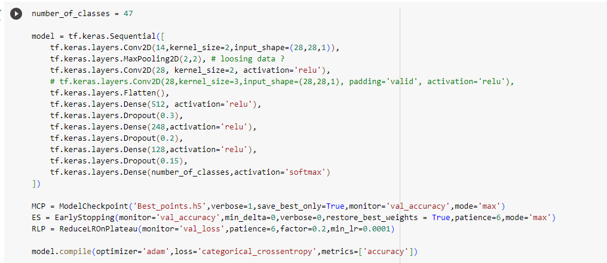
This gave me a 0.876 accuracy on test data and a 0.870 accuracy on validation set.

# STEP 3: DATA AUGMENTATION

To improve model accuracy I've decided to do some augmentation on train set.
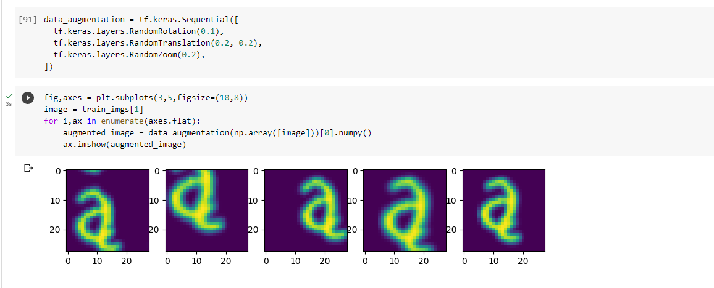
Augmentation was applied to rotations and translations as we dont really have any colors here.
Dataset shape after augmentation:
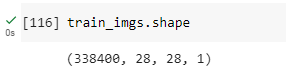

Also, I've decided to add another convolutional layer to increase the deepness of conv tensor.
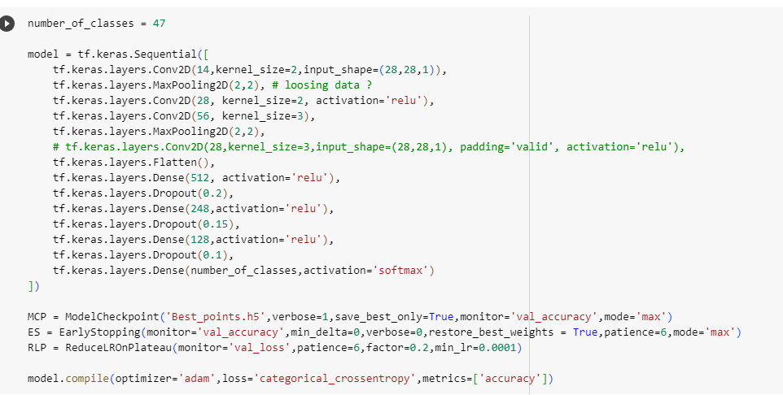

 Results after training for 27 epochs
 Test accuracy: 0.886
 Validation accuracy: 0.879

# USAGE GUIDE

- open windows powershell in EMNIST_Recognition directory
- ls command should show you this:
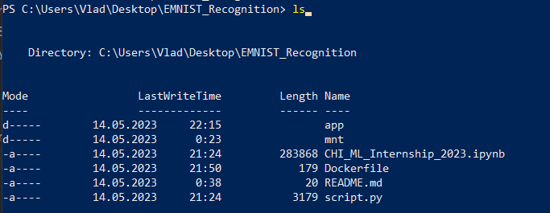
  
- build docker image using `docker build -t YOURNAME .` command
- run docker image via `docker run -it --rm YOURNAME python3 /app/inference.py --input /mnt/test_data/`

### Pay attention
There are already 3 samples in mnt/test_data folder, you can replace them with your images.
If you want to specify your own directory, please replace line 10 in dockerfile via

`COPY your_directory /your_directory` command

When running docker image, replace /mnt/test_data with /your_directory

### RUNNING script.py

- copy data from EMNIST dataset ( balanced dataset )
- install required libraries
- run the script via python 

# AUTHOR INFO
Kriuchkovskyi Vladyslav

kriuchkvskyi.vlad@gmail.com
  